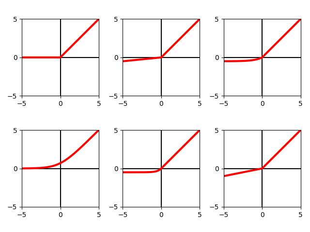

Comparison between state of the art computer vision models. Three popular models AlexNet, VGG and ResNet; similar but different in many perspectives were put into the test. The task was image classification.

Rather than exploring many different hyper parameter settings for every model, we performed tests using three different Optimization methods while employing six different activation functions as well as performing regularization with $L^2$-Norm (weight decay). Every train run was timed and an overview of the computational time across all setups was produced.

Activation functions:

Accuracies for each configuration can be seen in accuracies_with_weight_decay.csv (weight decay = 0.01, one run with learning rates set to 0.01 for RMSprop, 0.001 for Adam and 0.01 for SGD; and one run with learning rates set ti 0.1 for RMSprop, 0.0001 for Adam and 0.001 for SGD) and accuracies_without_weight_decay.csv. 

Similarly, loss can be found in loss_with_weight_decay.csv and loss_without_weight_decay.csv. For each configuration, there are 2 rows: one for training loss and one for validation loss.